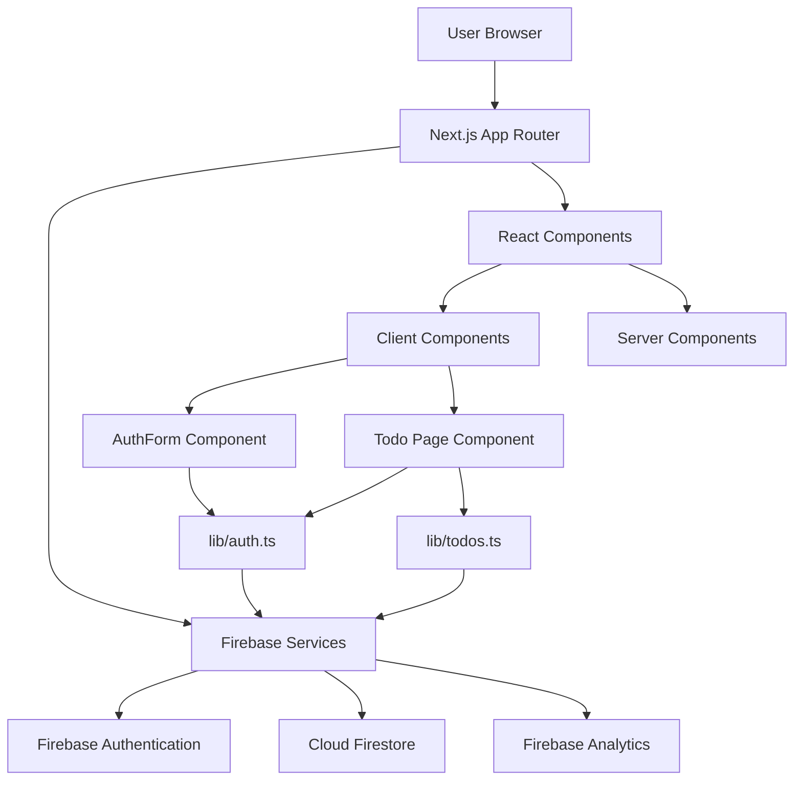
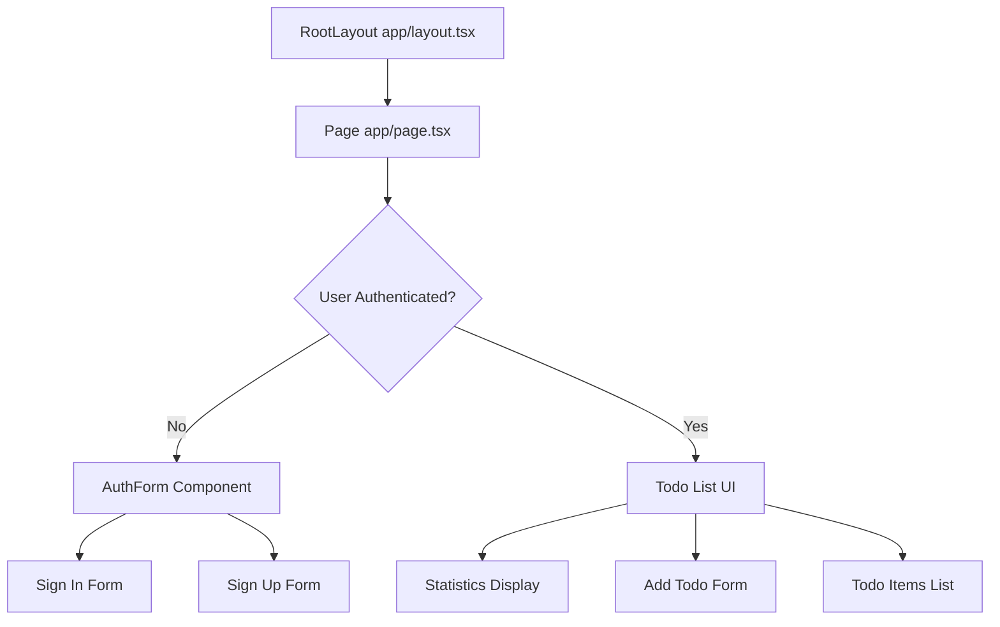

# Architecture Documentation

This document explains the overall architecture of the Todo List application, including system design, component hierarchy, and data flow patterns.

## System Architecture

The application follows a client-server architecture with Firebase as the backend-as-a-service (BaaS) provider.



## Frontend Architecture

### Next.js App Router Structure

The application uses Next.js 16 with the App Router, which provides:

- **Server Components by Default**: Components are server-rendered unless marked with `"use client"`
- **File-based Routing**: Routes are defined by the file structure
- **Layout System**: Shared layouts via `layout.tsx`
- **Metadata API**: SEO and page metadata configuration

### Component Hierarchy



### Component Breakdown

#### Root Layout (`app/layout.tsx`)
- Server Component (default)
- Provides HTML structure and metadata
- Imports global CSS styles
- Wraps all pages

#### Main Page (`app/page.tsx`)
- Client Component (`"use client"`)
- Manages application state (user, todos, loading)
- Handles authentication state changes
- Renders AuthForm or TodoList based on auth state

#### AuthForm Component (`app/components/AuthForm.tsx`)
- Client Component
- Handles sign in/sign up UI
- Manages form state and validation
- Calls authentication functions from `lib/auth.ts`

## Backend Architecture

### Firebase Services

The application uses three Firebase services:

1. **Firebase Authentication**
   - Email/Password authentication
   - User session management
   - Secure token-based authentication

2. **Cloud Firestore**
   - NoSQL document database
   - Real-time data synchronization
   - Security rules for data access control

3. **Firebase Analytics** (optional)
   - User behavior tracking
   - Performance monitoring

### Data Model

#### User Collection (Managed by Firebase Auth)
- User ID (uid)
- Email
- Authentication tokens

#### Todos Collection (Firestore)
```typescript
{
  id: string;           // Document ID
  userId: string;      // Owner's Firebase Auth UID
  text: string;        // Todo text content
  completed: boolean;   // Completion status
  createdAt: Timestamp; // Creation timestamp
}
```

## Library Structure

### `lib/firebase.ts`
- **Purpose**: Firebase initialization and configuration
- **Pattern**: Singleton pattern (prevents multiple Firebase instances)
- **Exports**: 
  - `auth`: Firebase Auth instance
  - `db`: Firestore database instance
  - `analytics`: Analytics instance (browser only)

### `lib/auth.ts`
- **Purpose**: Authentication wrapper functions
- **Functions**:
  - `signUp()`: Create new user account
  - `signIn()`: Sign in existing user
  - `signOut()`: Sign out current user
  - `onAuthStateChange()`: Listen to auth state changes
  - `getCurrentUser()`: Get current authenticated user

### `lib/todos.ts`
- **Purpose**: Todo CRUD operations and real-time subscriptions
- **Functions**:
  - `addTodo()`: Create new todo
  - `toggleTodo()`: Update todo completion status
  - `deleteTodo()`: Delete todo
  - `subscribeToTodos()`: Real-time todo list subscription

## State Management

The application uses React's built-in state management:

### Local Component State
- Managed with `useState` hook
- State includes:
  - `user`: Current authenticated user
  - `loading`: Loading state
  - `todos`: Array of todo items
  - `newTodoText`: Input field value
  - `addingTodo`: Loading state for add operation

### Real-time State Synchronization
- Firestore `onSnapshot` listeners automatically update state
- No manual state updates needed for data changes
- Changes sync across all connected clients

## Data Flow

### Authentication Flow

1. User enters credentials in AuthForm
2. AuthForm calls `signIn()` or `signUp()` from `lib/auth.ts`
3. Firebase Auth processes authentication
4. `onAuthStateChange` listener detects state change
5. Page component updates `user` state
6. UI switches from AuthForm to TodoList

### Todo Operations Flow

1. User performs action (add/toggle/delete)
2. Page component calls function from `lib/todos.ts`
3. Function updates Firestore document
4. Firestore triggers `onSnapshot` callback
5. Todo list state updates automatically
6. UI re-renders with new data

## Security Architecture

### Firestore Security Rules

The application uses Firestore security rules to ensure data privacy:

```javascript
// Users can only read/write their own todos
allow read, update, delete: if request.auth != null && 
                            request.auth.uid == resource.data.userId;
allow create: if request.auth != null && 
              request.auth.uid == request.resource.data.userId;
```

### Authentication Requirements
- All todo operations require authenticated user
- User ID is verified on both client and server (Firestore rules)
- No user can access another user's todos

## Real-time Synchronization

The application uses Firestore's real-time listeners (`onSnapshot`) to:

- Automatically sync todos across devices
- Update UI when data changes
- Handle concurrent edits gracefully
- Provide instant feedback to users

### Subscription Pattern

```typescript
// Subscribe to user's todos
const unsubscribe = subscribeToTodos(userId, (todos) => {
  setTodos(todos); // Update state when data changes
});

// Cleanup on unmount
return () => unsubscribe();
```

## Performance Considerations

1. **Code Splitting**: Next.js automatically splits code by route
2. **Server Components**: Default server rendering reduces client bundle
3. **Firestore Queries**: Filtered queries return only user's todos
4. **Lazy Loading**: Components load only when needed
5. **Optimistic Updates**: UI updates immediately, syncs in background

## Scalability

The architecture supports scaling through:

- **Firebase Auto-scaling**: Handles traffic spikes automatically
- **Client-side Rendering**: Reduces server load
- **Efficient Queries**: Indexed Firestore queries
- **CDN Distribution**: Next.js static assets via Vercel CDN

## Technology Choices Rationale

- **Next.js**: Modern React framework with excellent DX and performance
- **Firebase**: Rapid development with built-in auth and real-time DB
- **TypeScript**: Type safety reduces bugs and improves maintainability
- **Tailwind CSS**: Utility-first CSS for rapid UI development
- **App Router**: Latest Next.js routing with server components support

