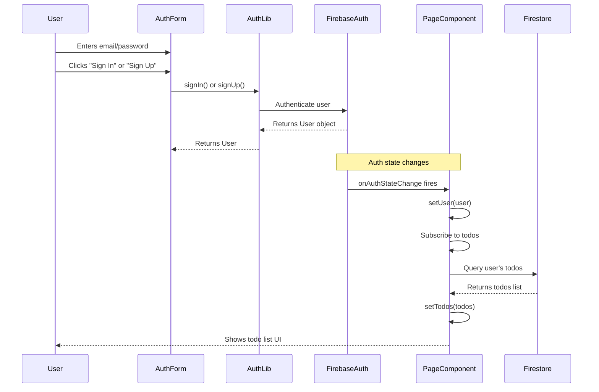
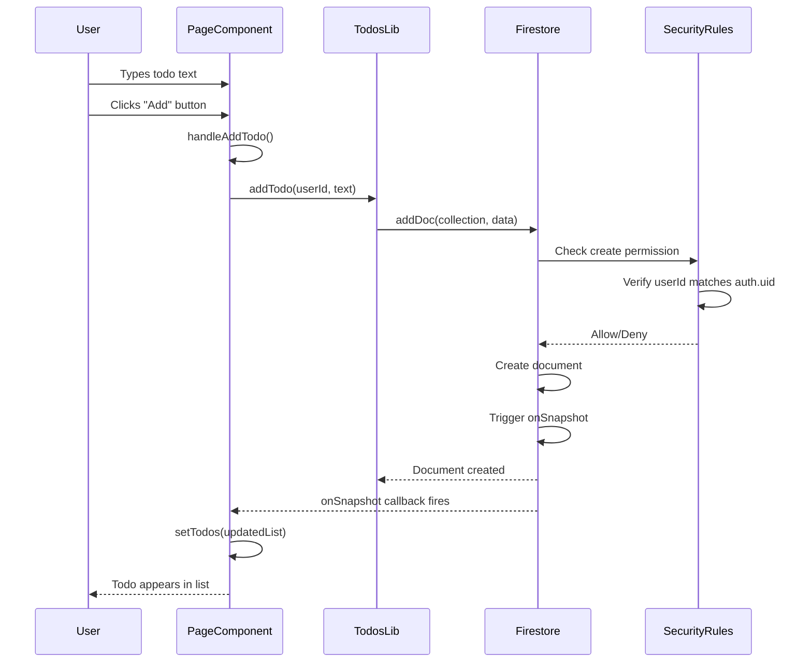
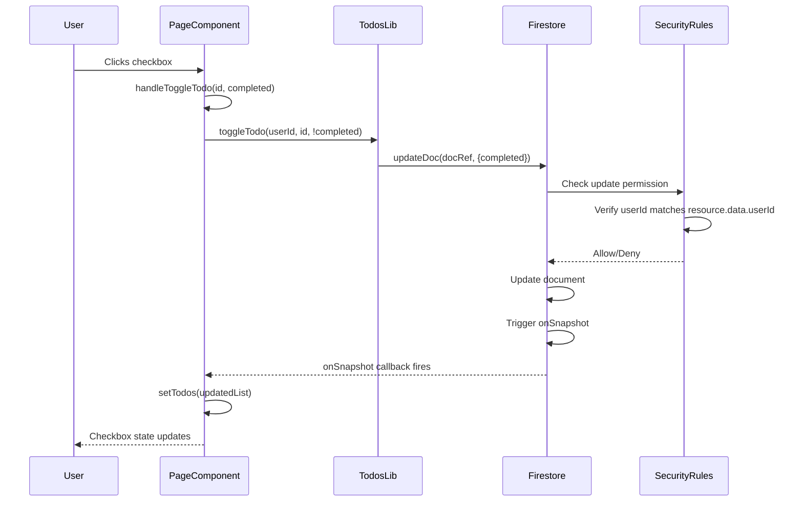
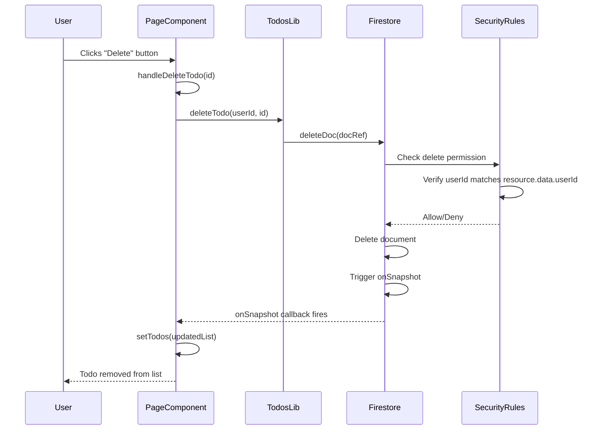
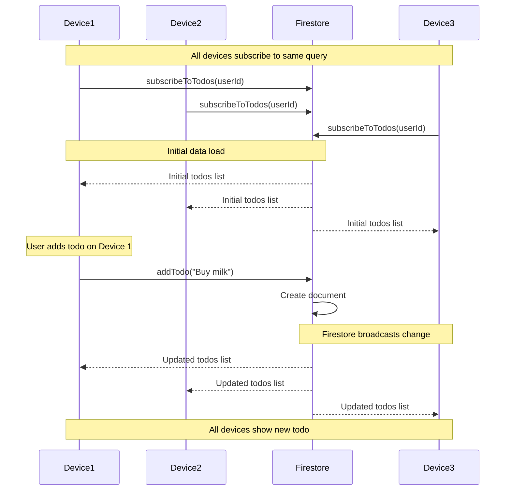
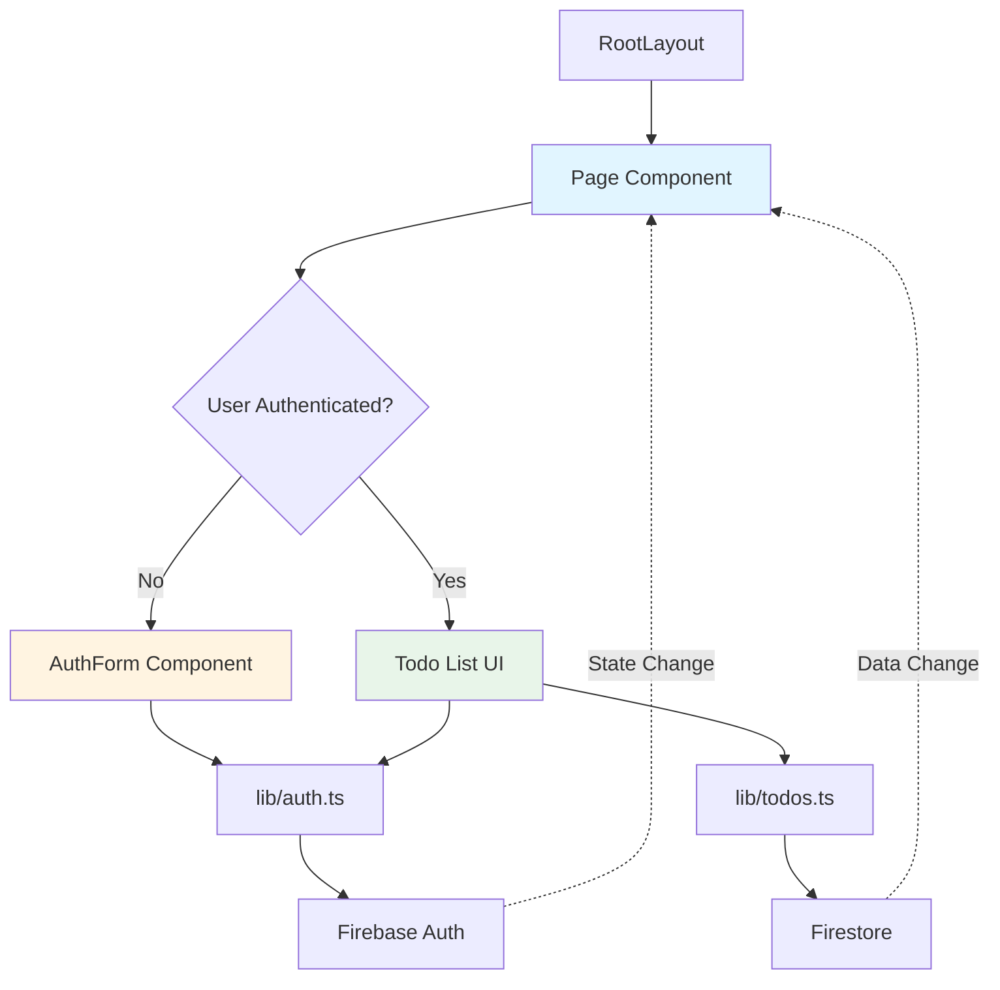
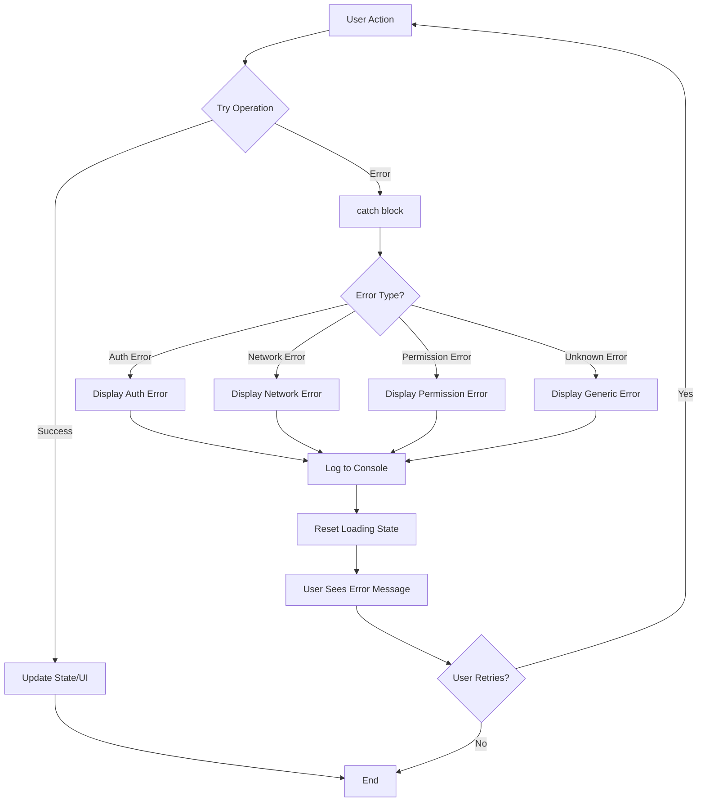
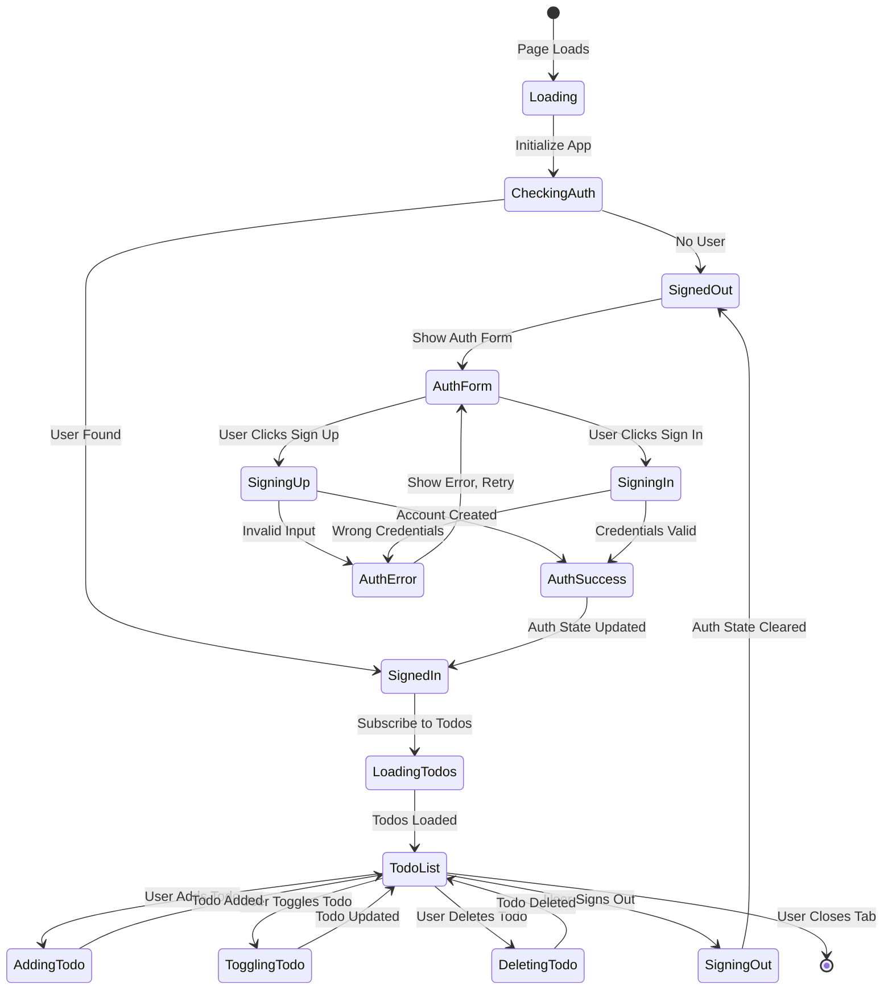

# Data Flow Documentation

This document explains how data flows through the application, from user interactions to UI updates. Understanding data flow helps you see how different parts of the application work together.

## Table of Contents

- [User Authentication Flow](#user-authentication-flow)
- [Todo CRUD Operations Flow](#todo-crud-operations-flow)
- [Real-time Synchronization Flow](#real-time-synchronization-flow)
- [Component Communication Patterns](#component-communication-patterns)
- [Error Handling Flow](#error-handling-flow)

---

## User Authentication Flow

This diagram shows what happens when a user signs in or signs up.



### Step-by-Step Explanation

1. **User Input**: User enters credentials in AuthForm component
2. **Form Submission**: AuthForm calls `signIn()` or `signUp()` from `lib/auth.ts`
3. **Firebase Authentication**: Function sends request to Firebase Auth service
4. **Authentication Response**: Firebase validates credentials and returns User object
5. **Auth State Change**: Firebase triggers `onAuthStateChange` listener
6. **State Update**: Page component updates `user` state with User object
7. **Todo Subscription**: Page component subscribes to user's todos
8. **Data Load**: Firestore returns user's todos
9. **UI Update**: Component renders todo list with data

### Code Flow

```typescript
// 1. User submits form
AuthForm.handleSubmit() 
  → signIn(email, password)
    → Firebase Auth validates
      → Returns User object

// 2. Auth state listener fires
onAuthStateChange((user) => {
  setUser(user); // Updates state
});

// 3. Effect runs when user changes
useEffect(() => {
  if (user) {
    subscribeToTodos(user.uid, (todos) => {
      setTodos(todos); // Updates todos
    });
  }
}, [user]);
```

---

## Todo CRUD Operations Flow

This section covers Create, Read, Update, and Delete operations for todos.

### Create Todo Flow



**Steps:**
1. User enters text and submits form
2. `handleAddTodo` validates input and calls `addTodo()`
3. `addTodo` creates document in Firestore
4. Security rules verify user owns the todo
5. Document is created
6. `onSnapshot` listener fires with updated data
7. Component state updates
8. UI re-renders showing new todo

### Update Todo Flow (Toggle Completion)



**Steps:**
1. User clicks checkbox
2. `handleToggleTodo` calls `toggleTodo()` with inverted status
3. `toggleTodo` updates Firestore document
4. Security rules verify ownership
5. Document updates
6. Real-time listener fires
7. UI updates automatically

### Delete Todo Flow



**Steps:**
1. User clicks delete button
2. `handleDeleteTodo` calls `deleteTodo()`
3. `deleteTodo` removes document from Firestore
4. Security rules verify ownership
5. Document is deleted
6. Real-time listener fires with updated list
7. UI updates automatically

---

## Real-time Synchronization Flow

Firestore's real-time listeners automatically sync data across all clients.



### How Real-time Sync Works

1. **Subscription**: Each device subscribes to user's todos query
2. **Initial Load**: Firestore sends current todos to all subscribers
3. **Change Detection**: When any device modifies data, Firestore detects change
4. **Broadcast**: Firestore sends updated data to all subscribers
5. **State Update**: Each device's `onSnapshot` callback fires
6. **UI Update**: Components update state and re-render

### Code Example

```typescript
// Device 1: User adds todo
await addTodo(userId, "Buy milk");
// Firestore creates document

// Device 2 & 3: Automatically receive update
subscribeToTodos(userId, (todos) => {
  // This callback fires automatically
  // todos now includes "Buy milk"
  setTodos(todos);
});
```

### Benefits

- **Instant Updates**: Changes appear immediately on all devices
- **No Polling**: Don't need to check for updates manually
- **Efficient**: Only sends changes, not full dataset
- **Offline Support**: Queues changes when offline, syncs when online

---

## Component Communication Patterns

This diagram shows how components communicate and share data.



### Data Flow Between Components

1. **RootLayout**: Provides HTML structure, doesn't manage state
2. **Page Component**: 
   - Manages all application state (`user`, `todos`)
   - Conditionally renders AuthForm or TodoUI
   - Listens to auth state changes
   - Subscribes to todos data
3. **AuthForm**: 
   - Manages form state (`email`, `password`)
   - Calls auth functions from `lib/auth.ts`
   - Doesn't directly update Page state (auth listener handles it)
4. **TodoUI**: 
   - Displays todos from Page state
   - Calls todo functions from `lib/todos.ts`
   - Updates happen via real-time listeners

### State Management Pattern

```typescript
// Page Component (Parent)
const [user, setUser] = useState(null);
const [todos, setTodos] = useState([]);

// Auth state listener updates user
onAuthStateChange((user) => setUser(user));

// Todo listener updates todos
subscribeToTodos(userId, (todos) => setTodos(todos));

// Child components receive data as props or access via functions
{user ? <TodoUI todos={todos} /> : <AuthForm />}
```

---

## Error Handling Flow

This diagram shows how errors are handled throughout the application.



### Error Handling Examples

#### Authentication Errors

```typescript
try {
  await signIn(email, password);
} catch (error) {
  // Firebase provides error.message
  setError(error.message);
  // Examples: "auth/user-not-found", "auth/wrong-password"
}
```

#### Todo Operation Errors

```typescript
try {
  await addTodo(userId, text);
} catch (error) {
  console.error("Error adding todo:", error);
  // Could be: network error, permission denied, etc.
  // UI shows generic error or specific message
}
```

#### Real-time Listener Errors

```typescript
const unsubscribe = onSnapshot(query, 
  (snapshot) => {
    // Success callback
    setTodos(snapshot.docs.map(...));
  },
  (error) => {
    // Error callback
    console.error("Listener error:", error);
    setError("Failed to load todos");
  }
);
```

### Error Handling Best Practices

1. **Always use try/catch** for async operations
2. **Display user-friendly messages** (not technical errors)
3. **Log errors** for debugging
4. **Reset loading states** in finally blocks
5. **Handle network errors** gracefully
6. **Validate input** before API calls

---

## Complete User Journey Flow

This diagram shows a complete user journey from first visit to adding todos.



### Key States

- **Loading**: Initial app load, checking authentication
- **SignedOut**: No authenticated user, showing auth form
- **SignedIn**: User authenticated, loading todos
- **TodoList**: Todos loaded, user can interact
- **Operations**: Adding, toggling, or deleting todos
- **Error States**: Handling various error conditions

---

## Summary

Understanding data flow helps you:

1. **Debug Issues**: Trace where data comes from and goes
2. **Add Features**: Know where to add new functionality
3. **Optimize Performance**: Identify bottlenecks
4. **Understand Architecture**: See how pieces fit together

Key takeaways:

- **State flows down** (parent to child via props)
- **Events flow up** (child calls parent functions)
- **Real-time listeners** automatically update state
- **Error handling** prevents crashes and improves UX
- **Security rules** protect data on the server side

For more details on specific concepts, see:
- [Concepts Documentation](./CONCEPTS.md) - Programming concepts
- [Code Walkthrough](./CODE_WALKTHROUGH.md) - Detailed code explanations
- [Architecture Documentation](./ARCHITECTURE.md) - System design

